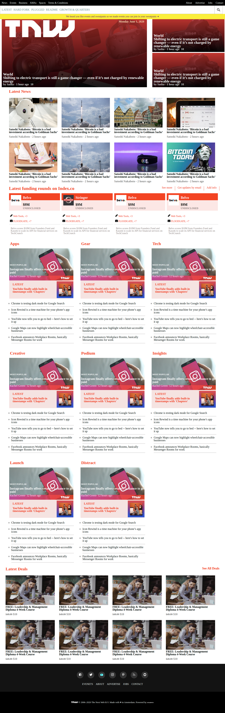

# Responsive-design
Responsive clone of thenextweb.com (Microverse Project)

Using media queries to achieve responsiveness.

## Built With

- Html
- CSS

## Live Demo

[Live Demo Link](https://rawcdn.githack.com/UmairAhmad125/the-next-web/4d9ebb429166650306ac0837eda200659fd63c37/index.html)

## Author

👤 **Umair Ahmad**

- Github: [@umairahmad125](https://github.com/UmairAhmad125)
- Linkedin: https://www.linkedin.com/in/umair-ahmad-b5a89015a/
- Twitter: [@umairahmadDP](https://twitter.com/umairahmadDP)
- email: (umairahmad125@gmail.com)

## Show your support

Give a ⭐️ if you like this project!

## Acknowledgments

- Project originally taken from The Odin Project
- Project inspired by Microverse Program

